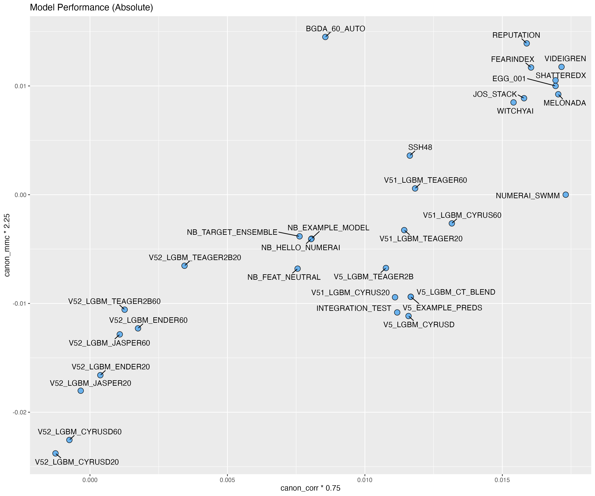
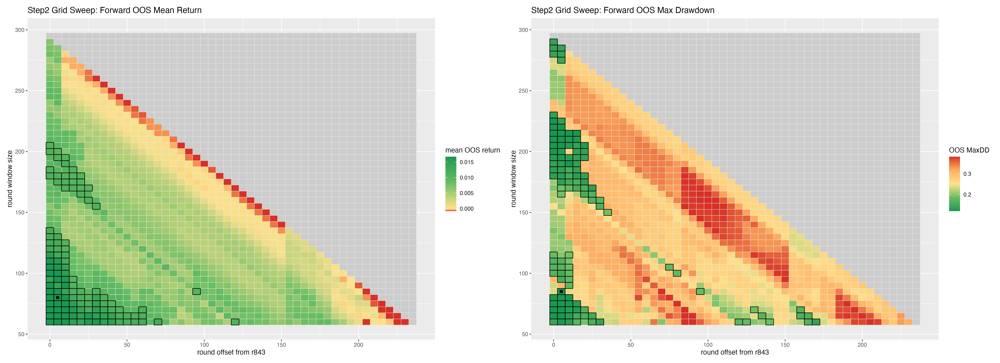
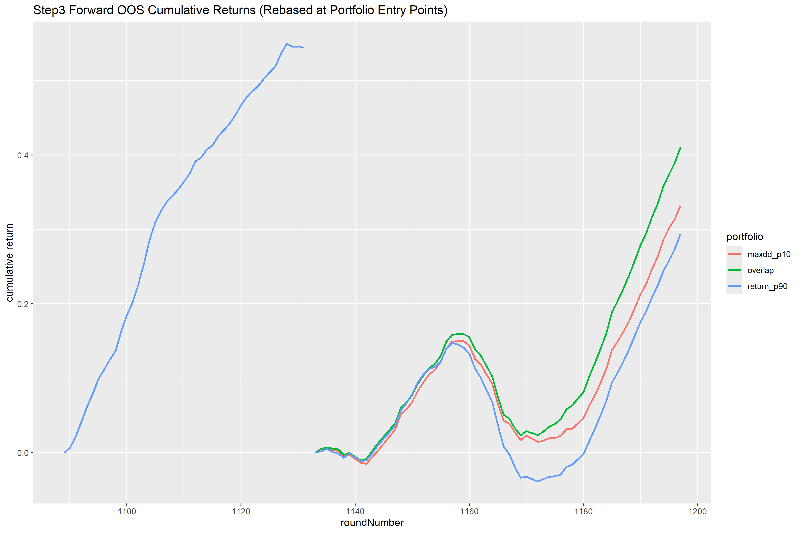

# vladthestaker

For changelog, see `CHANGELOG.md`.
For a Python alternative, see [numerai-portfolio-opt](https://github.com/eses-wk/numerai-portfolio-opt), although it has fallen behind in maintenance.

## Warnings

- This is not financial advice.
- This is an optimization/backtest workflow and can overfit historical behavior.
- Re-run with the latest data before changing live stake.
- The examples below are snapshots from the current `output/` directory and will change after reruns.

## Overview

Vlad helps you decide stake weights in Numerai using historical model score data. Use at your own risk.

Current workflow is a 3-step pipeline:

1. Fetch model performance history.
2. Sweep train/validation grid cells across different start offsets and training-window sizes that are used to build an average between a minvariance and tangency portfolio.
3. Build three averaged portfolios (`return_p90`, `maxdd_p10`, `overlap`) and compare forward OOS behavior.

Current default staking pick is to pick the `overlap` models, based on the overlap between top return and top (minimal) maxdrawdown portfolios from `output/step3-3xportfolio-weights.csv`.

Vlad uses CVaR (mean return in 5% worst days) as the risk measure that it tries to minimize in its minvariance portfolio, and as the risk measure in the return-versus-risk optimization in its tangency portfolio. Therefore, Vlad is predisposed to select portfolio's that do not have very strong burn-days.

## How to use

1. Edit `Optimize-Me.xlsx`:
   - Sheet `Models`: `ModelName`, `Starting Era`, `Notes`
   - Sheet `Parameters`: `Parameter`, `Value`, `Notes`
2. Run pipeline (recommended):
   - macOS/Linux: `./run_pipeline.sh`
   - Windows: `run_pipeline.bat`
3. Manual run (equivalent):

```bash
Rscript step1_get_data.R
Rscript step2_sweep_grid_windows.R
Rscript step3_build_3xportfolios_oos.R
```

4. Inspect outputs in `output/`:
   - Step1: `daily_data_corr_abs.csv`, `daily_data_corr_rel.csv`, `daily_data_mmc_abs.csv`, `daily_data_mmc_rel.csv`
   - Step2: `step2-grid-window-sweep.csv`, `step2-grid-window-sweep-oos-heatmap.png`, `model-performances-abs-corr-mmc.png`, `model-performances-rel-corr-mmc.png`
   - Step3: `step3-3xportfolio-weights.csv`, `step3-modelcomparison_last_N_oos_rounds.csv`, `step3-modelcomparison_all_rounds.csv`, `step3-forward-oos-cumulative-returns.png`

## Under the hood

Older Vlad versions relied heavily on resampling. The current version does not. Variation now comes from evaluating many grid cells with different training start offsets and training window sizes, then selecting strong regions from forward-OOS behavior.

Step3 builds three portfolio families:

- `return_p90`: top decile by forward OOS return
- `maxdd_p10`: lowest decile by forward OOS max drawdown
- `overlap`: intersection of return and maxdd selected cells

In practice, use `overlap` when you want a balanced default between return focus and drawdown control.

## How does the output look?

First, inspect model performance diagnostics from Step2. Shown here is the absolute performance for the models, but some models (like the 5.2 benchmark models) will have a shorter history. Depending on your model histories, use both the absolute and relative model comparison plots (see [`output/model-performances-rel-corr-mmc.png`](output/model-performances-rel-corr-mmc.png)) to make decisions on which models to include in future iterations of your `Optimize-Me.xlsx` file. Note that relative model comparison is still not a strictly fair comparison: the relative score of a model is its average relative score, and if a more recent batch of models were only evaluated during an _"easy"_ period in the Numer.ai tournament, they will unfairly stand out as top models.




Second, inspect the Step2 sweep heatmap. The top performing combination of offset from the first round + portfolio training window length is marked with a filled square. The top 10% (highest top 10% for return, lowest top 10% for max drawdown) are marked with black squares around the parameter combinations. Our source of robustness in this iteration of Vlad the Staker (v5.0) comes from creating an average portfolio from this 10% of parameter combinations, rather than from resampling from previous rounds (as we did in v4.0 and before).



Then inspect Step3 portfolio weights and metrics (`output/step3-3xportfolio-weights.csv`).
Then inspect Step3 model-vs-portfolio comparison metrics (`output/step3-modelcomparison_last_N_oos_rounds.csv` and `output/step3-modelcomparison_all_rounds.csv`).
In both modelcomparison files, missing rounds are excluded per row/model (no zero-fill imputation), so round-count columns can differ across rows.

Current `overlap` summary row:

```text
n_selected_cells=64        # number of models that were pooled and averaged, based on overlapping sweep parameters between top 10% return and bottom 10% maxdrawdown portfolios.
n_oos_rounds=60            # number of rounds on which the overlap model performance stats are based.
oos_return=0.006919844     # expected average return per round.
oos_CVaR=-0.02265425       # expected average return on the worst 5% of days.
oos_maxdd=0.1286154        # Max drawdown (a description of risk. Lower is better).
```

Note that because step 3 pools and averages models based on their out-of-sample performance, we no longer have a true out of sample metric. So track the forward performance of your new metamodel!

Current suggested metamodel based on the `overlap` portfolio:

```text
SHATTEREDX           0.23818283
EGG_001              0.17604081
NB_TARGET_ENSEMBLE   0.11080958
JOS_STACK            0.10542928
FEARINDEX            0.09935092
NB_FEAT_NEUTRAL      0.06507597
REPUTATION           0.05751641
VIDEIGREN            0.05644039
V51_LGBM_TEAGER60    0.02128464
V51_LGBM_TEAGER20    0.01951700
V5_LGBM_TEAGER2B     0.01841735
SSH48                0.01609449
WITCHYAI             0.00772738
NB_EXAMPLE_MODEL     0.00452501
MELONADA             0.00350762
V5_LGBM_CYRUSD       0.00008032
```

For our example models, we used Numer.ai's benchmark models, and the highest-staked model of the 10 masters and grandmasters of the 2025 season.

## Visualisation of cumulative portfolios

Finally, inspect forward OOS cumulative behavior from Step3.



Use this figure to compare the stability and trajectory of `return_p90`, `maxdd_p10`, and `overlap` over shared forward-OOS periods.

Also look at the 2 modelcomparison csv's generated by step3 (one on the last 60 out-of-sample rounds, one on all rounds). Both csv's
compares the Vlad-build portfolio models against the input models on corr_return, return, CVaR and max-drawdown. 

You can see that the (grand)master models are a tough crowd to improve on!, but for your own models Vlad can probably add value.


## Tunable parameters

All tunable settings are read from `Optimize-Me.xlsx` sheet `Parameters`. Scripts fail fast if required keys are missing or invalid.

Environment:

- Intended for R `4.5.2`
- Uses `groundhog` for date-pinned package installs

## Disclaimer

- The information and code in this repository are for educational and operational tooling purposes only.
- No guarantee is provided on accuracy, completeness, or fitness for financial decisions.
- You are responsible for validating outputs before using them for staking decisions.
